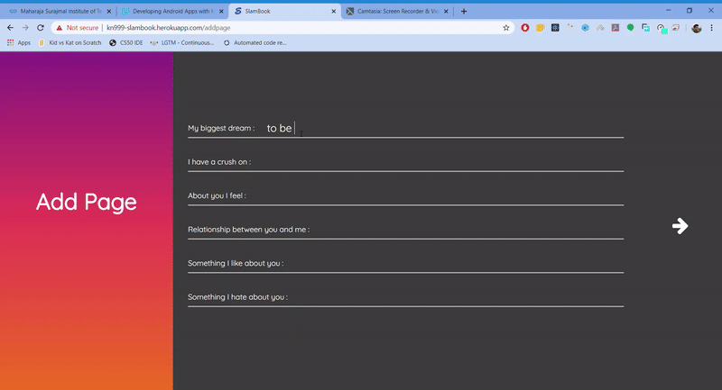

# Slambook
A online implementation of the classic Slam Book where users can register themselves and create their own custom Slam Book, which later can be shared with other users to. Users can also search for specific profiles and provide answers. Check it out - https://kn999-slambook.herokuapp.com/

  <label>
    <h2>Login to the App</h2>
  </label>
  
    
  

  <label>
    <h2>Register to the App</h2>
  </label>
  
    
  

  <label>
    <h2>Adding SlamPage to other's Slambook</h2>
  </label>
  
    
  

  <label>
    <h2>Login to the App</h2>
  </label>
  
    
  

